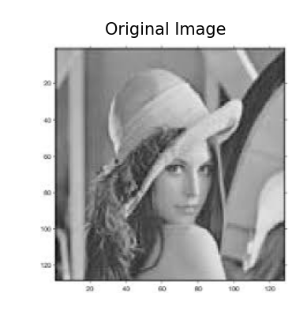
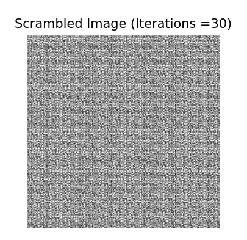
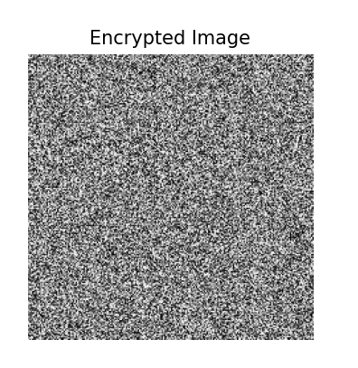
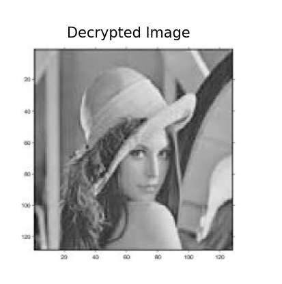

# Image Scrambling and Encryption with S-DES

This project implements a method for scrambling and encrypting images using the Arnold Cat Map and the Simplified Data Encryption Standard (S-DES). The goal is to demonstrate how these techniques can be combined to enhance image security.

## Project Structure

The repository consists of three main Python files:

1. **`s-des.py`**: Contains the implementation of the S-DES algorithm, including key generation, encryption, and decryption functions.
2. **`arnold_cat_map.py`**: Implements the Arnold Cat Map for scrambling and unscrambling images.
3. **`main.py`**: The main file that orchestrates the image processing pipeline. It takes an image, scrambles it using the Arnold Cat Map, encrypts it with S-DES, decrypts it, and then unscrambles it to retrieve the original image.

## Installation

To run the code, make sure you have the following Python libraries installed: Numpy, Pillow, Matplotlib

## Code Explanation

# S-DES Implementation:
The S-DES algorithm involves key generation, permutation, and substitution processes to encrypt and decrypt 8-bit blocks of data.

# Arnold Cat Map:
The Arnold Cat Map is a chaotic map that rearranges the pixels of the image in a way that makes the image appear scrambled. The inverse map is used to restore the original pixel arrangement.

# Main Pipeline:
The main.py file handles loading the image, applying the Arnold Cat Map for scrambling, encrypting the scrambled image using S-DES, decrypting it, and finally unscrambling it to obtain the original image.

## Output Screenshots
Here are some screenshots of the output from the program:

